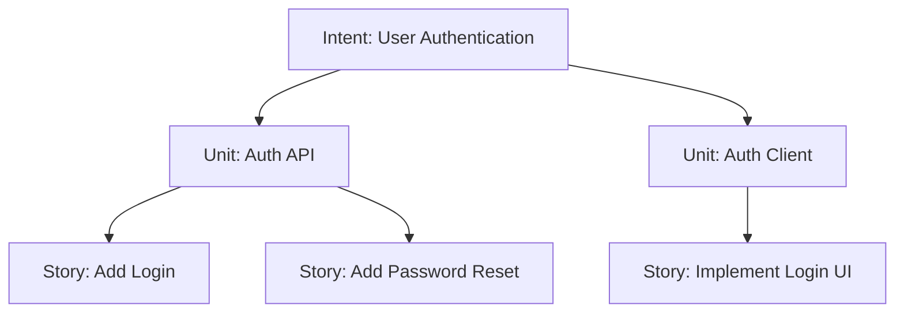
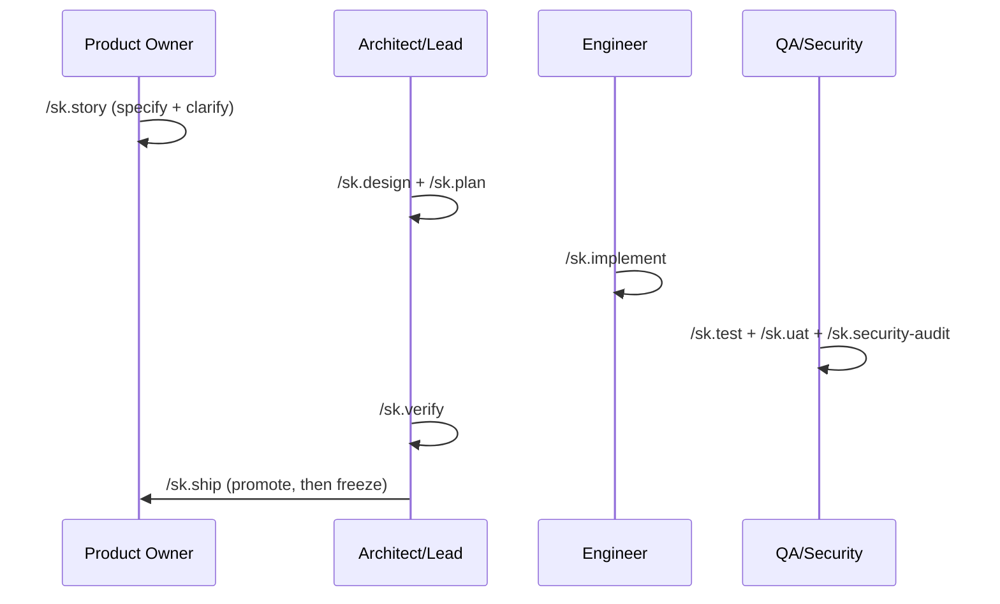

# 🚀 SpecKit-SSD-SDLC

> **The SDLC framework for AI-Native Engineering Teams.**

**SpecKit-SSD-SDLC** (Spec-Driven Development) provides a structured, high-fidelity process for cross-functional teams to collaborate with AI agents. It eliminates "hallucination-by-omission" by enforcing a strict hierarchy of truth from business intent to verified code.

---

## 📖 Table of Contents
- [🎯 The SpecKit Way (Philosophy)](#-the-speckit-way-philosophy)
- [⚡ Quick Start: Team Onramp](#-quick-start-team-onramp)
- [🧭 Where Knowledge Lives](#-where-knowledge-lives)
- [🎭 Role-Based Workflows](#-role-based-workflows)
- [📜 Command Reference](#-command-reference)
- [📦 Artifact Reference](#-artifact-reference)
- [🏗️ FAQ & Technical Details](#-faq--technical-details)
- [🧪 Testing the Framework](#-testing-the-framework)

---

## 🎯 The SpecKit Way (Philosophy)

SpecKit is built on a single core principle: **Context is the currency of AI productivity.**

Most AI failures occur because the model lacks context on *why* a decision was made. SpecKit solves this via:
1. **The Hierarchy of Truth**: Intent (Business Value) → Unit (Technical Domain) → Story (Atomic Task).
2. **One Home per Fact**: Every kind of project knowledge has exactly one file. Skills read the home — never a summary copy of it.
3. **Atomic Context Tiers**: 3-tiered Knowledge Bases that prevent LLM context-overflow.
4. **Spec-Aware Gates**: Every implementation step is validated against high-level specs before it can be shipped.

The framework owns the **process**; your project owns the **knowledge**. SpecKit ships no stack or architecture opinion — it checks work against *your* constitution, *your* ADRs and *your* coding rules.

---

## ⚡ Quick Start: Team Onramp

### 1. Initialize for the Team
SpecKit is added as a **git subtree** under `.speckit/` so you can stay in sync with upstream framework improvements.

```bash
git remote add --no-tags framework git@github.com:ajorobert/SpecPipeline.git
git fetch framework --no-tags
git subtree add --prefix=.speckit framework main --squash
bash .speckit/setup.sh                 # add --gemini to also maintain GEMINI.md
/sk.init                               # detect existing homes + conventions, propose .specify/profile.yaml
/sk.init --answers <file>              # same, non-interactive (answers file confirms the proposals)
```

`main` is the release branch (tagged by version, see `VERSION`); `dev` is the integration branch.

`/sk.init` never assumes a blank repository. It detects what your repository already has — ADRs, bounded
contexts, canonical OpenAPI/AsyncAPI specs, `.claude/rules/`, the skills Registry, `CONTRIBUTING.md`, branch
and commit conventions from git history — and proposes values for `.specify/profile.yaml`, the project router
(`.specify/memory/projects/index.md`) and per-project `tech-stack.md` snapshots. The constitution holds only
the principles your team states. A missing home (for example `specs/adr/adr-index.md`) is created only when
you confirm it; `install.scaffold_skip` lists homes it must never create.

**Add your stack knowledge (capability packs).** Copy the packs you want from `.speckit/skills_archive/` (or
write your own) into `.claude/skills/<pack>/`, then register each one in the `## Registry` table of
`.claude/skills/README.md`:

```bash
cp -r .speckit/skills_archive/<area>/<pack> .claude/skills/
# then add a row to the ## Registry table in .claude/skills/README.md
```

Skills load packs only through `.claude/skills/governance/pack-resolution.md` (weighted, per-project scoring
against story tags and the working text); the framework itself names no pack.

### What `setup.sh` touches
| Path | Behaviour |
|---|---|
| `.claude/skills/sk.*`, `.claude/skills/governance/`, framework agents (by name), `.claude/hooks/*.sh` | Synced (framework-owned; `sk.*` is a reserved namespace) |
| `.claude/.speckit-manifest` | Written (version + owned paths) |
| `.claude/settings.json` | Merged — SpecKit hooks added if absent, deny rules unioned; your `allow` list and `defaultMode` are never touched |
| `CLAUDE.md` | Only the region between the `SPECKIT-SSD-SDLC MANAGED` markers is replaced, rendered from `.specify/profile.yaml` |
| `GEMINI.md` | Same managed-region splice, only when opted in (`--gemini` or `install.gemini: true`) |
| `.specify/state/` | Created (per-developer runtime state) with its `.gitignore` entry |
| `.specify/profile.yaml` | Read, never written |
| Project knowledge (`specs/**`, `.specify/memory/**`, `history/**`) | Never created — `/sk.init` and each home's writer create them on first use |
| Everything else under `.claude/` (`rules/`, your packs and the skills README Registry, `commands/`, other agents, `settings.local.json`, …) | Never read, written, archived, or listed |

### 2. Enter a Session
Every member of the team adopts a persona to unlock specialized commands:

```bash
/sk.session start --role {po | architect | lead | backend | frontend | backend-qa | frontend-qa | security}
```

Branch, commit and PR conventions come from `vcs.*` in `.specify/profile.yaml` (`/sk.session start --branch`
creates a branch; by default the current branch is recorded).

### 3. Set Your Focus
Agents work best when they have a laser-focus. Use `/sk.session focus` to lock onto a story.
```bash
/sk.session focus --story story-AUTH-001
```

---

## 🧭 Where Knowledge Lives

Every fact has one fixed home. The full table — who writes each home, who loads it, and the loading rules —
is `.claude/skills/governance/profile.md`; [docs/memory-guide.md](docs/memory-guide.md) is the overview.

| Knowledge | Home |
|---|---|
| Why the system exists, actors, domain map (tier 1) | `specs/knowledge-base.md` (`@import`ed by `CLAUDE.md`) |
| Fixed core principles | `.specify/memory/constitution.md` — the team's stated principles only |
| Architecture decisions | `specs/adr/NNNN-kebab-title.md`, loaded through the router `specs/adr/adr-index.md` (ALWAYS block + signal blocks) |
| Bounded contexts; one context's rules and invariants (tier 2) | `specs/domain/bounded-contexts.md` → `specs/domain/{module}.md` |
| Contracts (canonical) | `specs/openapi/{audience}.yaml`, `specs/asyncapi/{module}.yaml` — edited in place on the feature branch |
| Coding rules | `.claude/rules/{stack}/<topic>.md` (path-scoped; stacks mapped to projects by `rules.stacks`) |
| Project skills | `.claude/skills/<pack>/`, registered in the `## Registry` table of `.claude/skills/README.md` |
| Projects (name · type · code root · role) | `.specify/memory/projects/index.md` (router) + `projects/{Project}/tech-stack.md` snapshots |
| Entities and schema | the code |
| Project facts (vcs, tracker, contract verification, never-autoload paths) | `.specify/profile.yaml` |

**Precedence on conflict:** constitution → ADRs (as routed) → `.claude/rules/` → capability packs → the unit's
`02-design/` → existing code. The conflict is flagged in the skill's output.

Paths listed in `knowledge.never_autoload`, and every shipped (frozen) unit other than the active one, are never
loaded unless a human names the file.

---

## 🎭 Role-Based Workflows

SpecKit provides specialized "rails" for every team member. Follow the path for your role:

### 🖋️ Product Owner: From Intent to Story
Your goal is to define *what* gets built without getting bogged down in implementation.
1. **Capture Intent**: `/sk.story` — Decompose a business goal into Units and Stories (`--jira {KEY}` seeds from a tracker issue).
2. **Clarify**: The agent will loop until the story meets the "Definition of Ready."
3. **Review Ready**: Use `/sk.session list` to see which stories are `ready` for the Architect.

> **🔍 Review Ritual:** Audit `intent.md` and the `01-story/` artifacts (`story.md`, `acceptance-criteria.md`) under `specs/intents/{intent}/units/{unit}/`. Ensure the **Acceptance Criteria** are measurable and match your original business goal.

### 📐 Architect: From Requirement to Contract
Your goal is to ensure technical consistency across services.
1. **Design**: `/sk.design` — Generate `02-design/` `architecture.md`, `database-design.md` and `contract-changes.md`, and edit the canonical `specs/openapi|asyncapi` files on the feature branch.
2. **ADR**: `/sk.adr` — Record significant technical decisions in `specs/adr/` and route them in `adr-index.md`.
3. **Guide**: The unit's routing `guide.yaml` is auto-generated to keep future developers oriented.

> **🔍 Review Ritual:** Audit `02-design/architecture.md`, the branch diff of the canonical `specs/openapi/` / `specs/asyncapi/` files, and `02-design/contract-changes.md` (change list, compatibility class per change, verification). Verify that the **Domain Boundaries** in `specs/domain/` are respected and that every `breaking` change has a versioned replacement or an ADR accepting the break.

### 💻 Engineer: From Plan to Code
Your goal is high-quality implementation with zero technical debt.
1. **Plan**: `/sk.plan` — Generate one technical implementation plan per impacted project.
2. **Implement**: `/sk.implement` — Follow the plan's checklist to write code and tests.
3. **Review**: `/sk.review` — Perform a spec-aware self-review against your constitution, routed ADRs and `.claude/rules/{stack}/`.

> **🔍 Review Ritual:** Audit `03-plan/{Project}/plan.md` and `tasks.md`, then track delivery in `04-implementation/{Project}/progress.md`. Check `history/prompts/` for any novel tradeoffs recorded during complex implementations.

### 🛡️ QA & Security: The Quality Gate
Your goal is to certify that the work meets the team's standards.
1. **Verify Contracts**: `/sk.test` — Run `contracts.verify` from the profile when set; otherwise provider/consumer contract tests against the canonical spec.
2. **UAT**: `/sk.uat` — Perform acceptance testing against the criteria in the story.
3. **Audit**: `/sk.security-audit` — Run OWASP/STRIDE scans before shipping.

> **🔍 Review Ritual:** Audit the provider/consumer test plan in `02-design/contract-changes.md`, the `05-test/{Project}/` suites, `06-uat/signoff.md`, and `07-security-audit/owasp-report.md`. Verify that **all** Acceptance Criteria have mapped tests and no CRITICAL vulnerabilities are open.

### 🚢 Ship: Promote, then Freeze
`/sk.ship` first **promotes** the unit's durable knowledge to its home — decisions to ADRs, domain rules to
`specs/domain/{module}.md`, checkable coding rules to `.claude/rules/{stack}/`, system context to
`specs/knowledge-base.md` — and records the list in the unit's `promotion.md`. Promotion writes ship in the
same PR. On `SK_RESULT: PASS` the story becomes `shipped` and the unit folder **freezes**: read-only, and
excluded from every skill's loading except while it is the active unit. New work on the same feature starts a
new unit. See `.claude/skills/governance/promotion.md`.

### 🔗 Tracker Mirror
The framework is the record: the story ID and `status.current` in `01-story/story.md` are the truth, and the
tracker issue (for example Jira, with `tracker.kind: jira`) follows every transition one way. Status changes
only through `bash .claude/hooks/story-status.sh set <status> --by <skill>` (or the hooks); each transition
queues a mirror entry in `.specify/state/tracker-outbox/`, which the model applies through its tracker
connector at the end of the turn. Failed entries are never dropped: `story-status.sh show` reports them and
`story-status.sh mirror-retry` re-queues them. See `.claude/skills/governance/tracker-mirror.md`.

---

### 3. Understand the Hierarchy & Session Focus

SpecKit organizes work into a strict top-down structure:
- **Intent**: A high-level business goal or feature (e.g., *User Authentication*).
- **Unit**: A specific technical bounded context or service (e.g., *Auth API*).
- **Story**: A single developer task or atomic slice of work (e.g., *Add password reset endpoint*).



**How do commands know what to work on?**
You use `/sk.session focus` to lock your agent onto a specific level. SpecKit saves this in `.specify/state/session.yaml` (per-developer, gitignored). Every `/sk.*` command reads this file, so the agent intrinsically knows which story or unit it is modifying without you having to repeatedly specify it.

**How do you move from Intent to Story?**
1. Run `/sk.story` on an **Intent**—the agent will autonomously decompose it into **Units** and **Stories**, and loop through clarification until the output meets completeness requirements.
2. Shift your focus downward using your session to execute the actual technical work:

```bash
/sk.session focus --intent user-auth               # Focus high-level for /sk.impact
/sk.session focus --unit auth-api                  # Shift focus downward for /sk.design
/sk.session focus --story story-AUTH-API-001       # Shift focus to the exact ticket for /sk.plan and /sk.implement
```

> **💡 Where do these names come from?**
> The `/sk.story` command automatically generates these tracking IDs, names, and their corresponding markdown files under `specs/intents/` when you outline and decompose work.
>
> **📊 How do I check story statuses?**
> Run `/sk.session list` to get a live dashboard view of all stories and their current workflow phase (`draft → ready → in-progress → testing → review → verify → security-review → done → shipped`, plus `review-rejected` and `rolled-back`). `bash .claude/hooks/story-status.sh show` prints the active story's status, roll-up fields and pending tracker mirrors.

### 4. Run the SDLC



Commands marked `[optional]` are skippable. Commands marked `[conditional]` are required only in certain cases. Everything else is mandatory.

```
── SPECIFY ──────────────────────────────────────────────────────────────────────
/sk.story                ← capture intent → units → stories; ensures completeness via clarify loop (po)
                           --bug flag: bug report framing (expected/actual/repro) instead of user story
                           --jira {KEY}: seed from a tracker issue
/sk.story --specify      ← [targeted] run Capture phase only: interview matrix → decomposition (po)
/sk.story --clarify      ← [targeted] run Clarify loop: resolves business ambiguities (po)
[/sk.impact]             ← [optional] assess blast radius on existing services (architect)

── ARCHITECTURE ─────────────────────────────────────────────────────────────────
/sk.design               ← full design pipeline: architecture → data model → contracts → UI (architect)
                           [conditional: runs based on unit stories and checkpoint mode]
[/sk.adr]                ← [optional] record or supersede an architecture decision (architect)

── PLAN ─────────────────────────────────────────────────────────────────────────
/sk.plan                 ← unit-level technical implementation plan and cross-artifact analysis (lead)
[/sk.knowledge-base]     ← [optional] generate or update knowledge base tiers (architect)

── FAST TRACK ───────────────────────────────────────────────────────────────────
[/sk.ff]                 ← sk.story→design→plan in one shot (lead)
                           --bug flag: runs sk.story --bug; design runs per checkpoint_mode
[/sk.hotfix]             ← P0 incident fast path: plan→implement→ship (lead)

── IMPLEMENT ────────────────────────────────────────────────────────────────────
/sk.implement            ← execute implementation per impacted project (lead → backend/frontend/mobile)
[/sk.investigate]        ← [optional] spec-aware debugging when blocked (backend/frontend)
[/sk.migrate]            ← [optional] db migration lifecycle via expand/contract (backend)
[/sk.phr]                ← [optional] record significant decisions or tradeoffs made (any)

── REVIEW & QUALITY ─────────────────────────────────────────────────────────────
[/sk.review]             ← [recommended] spec-aware code review: constitution + ADRs + rules + contracts (backend/frontend)
/sk.test                 ← generate & run unit, integration and contract tests per project (lead → QA)
[/sk.uat]                ← [conditional: frontend work] user acceptance testing per surface (frontend-qa)
                           --platform {surface} → tooling from the project's tech-stack.md (Platform, E2E Tooling)
                           native surfaces never use browser tooling
/sk.security-audit       ← OWASP Top 10 + STRIDE audit, secrets scan (security)
/sk.verify               ← PASS/FAIL across all quality gates — must pass before ship (architect)
                           Gate 1: Spec | Gate 2: Architecture (domain, ADRs, ADR guard)
                           Gate 3: Plan (contract-changes, compat classes) | Gate 4: Implementation (tasks, rules)
                           Gate 5: Test (contracts.verify / contract tests, E2E) | Gate 6: Security (OWASP/Secrets)
                           Gate 7: Ship (promotion, tracker mirror)

── SHIP ─────────────────────────────────────────────────────────────────────────
/sk.ship                 ← promote durable knowledge, then PR; /sk.verify must pass (lead)
/sk.rollback             ← automated or manual rollback plan for a shipped story (lead)
```

---

## 📜 Command Reference

### 🛠️ Setup & Session
```text
/sk.init             ← Detect homes + conventions, propose .specify/profile.yaml, project router, tech-stack snapshots,
                       constitution (team-stated only) [--answers <file> non-interactive] (any)
/sk.session          ← Manage local session: start/end/switch/focus/restore/status/list (any)
```

### 📋 Specify & Plan
```text
/sk.story            ← Full cycle intent → story capture + validation loop [--bug, --jira {KEY}] (po)
/sk.story --specify  ← [Targeted] Capture intent → unit → story; --bug for bug report (po)
/sk.story --clarify  ← [Targeted] Resolve business ambiguities (po)
/sk.impact           ← Assess blast radius of proposed work; risk level + checkpoint mode (architect)
/sk.design           ← Full design pipeline: architecture → data model → canonical contracts + contract-changes.md
                       → UI design (frontend units) → unit routing guide (architect)
/sk.plan             ← Unit-level technical implementation plan per impacted project + analysis (lead)
/sk.ff               ← Fast-forward: story → design (per checkpoint_mode) → plan; --bug for bug fixes (lead)
/sk.hotfix           ← P0 incident fast path: plan→implement→ship, branch per vcs.hotfix_base (lead)
```

### 💻 Implement & Review
```text
/sk.implement        ← Scaffold + generate code per impacted project [--projects {key}] (lead → backend/frontend/mobile)
/sk.migrate          ← Database migration lifecycle [expand/contract] per the schema owner's tech-stack.md (backend)
/sk.review           ← Spec-aware code review: constitution + routed ADRs + .claude/rules/{stack}/ + contracts (backend/frontend)
```

### 🛡️ Quality & Security
```text
/sk.verify           ← PASS/FAIL quality gate across all gates [run after test, before ship] (architect)
/sk.test             ← Generate & run tests per project; contracts.verify or contract tests (lead → QA)
/sk.uat              ← Acceptance testing per surface: --platform {surface} (frontend-qa)
/sk.security-audit   ← OWASP Top 10 + STRIDE audit, secrets scan (security)
/sk.investigate      ← Spec-aware debugging (backend/frontend)
```

### 📚 History & Knowledge
```text
/sk.knowledge-base   ← Generate or update knowledge base tier [--tier system|domain|unit, size-limited] (architect)
/sk.adr              ← Create or supersede an ADR in specs/adr/, routed in adr-index.md (architect)
/sk.phr              ← Record Prompt History for significant decisions (any)
```

### 🚀 Operations & Shipping
```text
/sk.ship             ← Promote, then PR: /sk.verify must pass [--dry-run] (lead)
/sk.rollback         ← Rollback plan for a shipped story (lead)
```

---

## 📦 Artifact Reference

SpecKit organizes what it generates around **knowledge homes** (one fixed path per fact — see
[Where Knowledge Lives](#-where-knowledge-lives)) and a **specs layer** (`specs/intents/`) where every unit of
work flows through seven numbered phases. Plan, implementation, and test phases fan out into one sub-folder
**per impacted project**.

SpecKit maintains these kinds of memory:

| Memory Type | Purpose | Location |
|---|---|---|
| Project Profile | Project facts: vcs, tracker, contracts, rules stacks, never-autoload paths | `.specify/profile.yaml` |
| Project Memory | Constitution, project router, per-project stack snapshots | `.specify/memory/` |
| Knowledge Homes | Decisions, domain, contracts, coding rules | `specs/adr/`, `specs/domain/`, `specs/openapi/`, `specs/asyncapi/`, `.claude/rules/` |
| Knowledge Base | System, domain, and unit non-derivable context | `specs/knowledge-base.md`, `specs/domain/{module}.md`, unit `knowledge-base.md` |
| Session State | Current role, branch and focus; running skill; tracker outbox | `.specify/state/` (gitignored) |
| Prompt Cache Tiers | Optimize AI context reuse | Internal prompt injection strategy |
| Story | A specific piece of work being implemented | `specs/intents/` (generated by `/sk.story`) |

### Memory Layer — `.specify/` (via `/sk.init`)

The profile, a workspace router, and isolated per-project stack snapshots.

```text
.specify/
├── profile.yaml                  # project facts only; every key optional (template: templates/project/.specify/profile.yaml)
├── memory/
│   ├── constitution.md           # the team's fixed core principles only
│   └── projects/
│       ├── index.md              # ROUTER (always loaded): Project · Type · Code Root · Role
│       ├── Backend.API/
│       │   └── tech-stack.md     # dated version snapshot, test layout, E2E tooling, ## Migrations
│       ├── Customer.Web/
│       │   └── tech-stack.md
│       └── Mobile.App/
│           └── tech-stack.md
└── state/                        # per-developer runtime state (gitignored)
```

- **`projects/index.md`** is the always-loaded router. Every per-project command reads it first to map a project name to its type, `code-root` and role.
- Each project owns an isolated `tech-stack.md` so context stays scoped — a backend task never loads mobile tooling. `sk.plan` refreshes a snapshot older than 90 days.
- **Coding rules** live in `.claude/rules/{stack}/`, mapped to projects by `rules.stacks`; Claude Code loads them by path.
- **Capability packs** are registered in the `## Registry` table of `.claude/skills/README.md`. sk.* skills read it through
  `.claude/skills/governance/pack-resolution.md`; the framework itself names no pack.

### Ownership tiers
| Tier | Owner | Paths |
|---|---|---|
| Framework | SpecKit (synced by `setup.sh`) | `.claude/skills/sk.*`, `.claude/skills/governance`, framework agents, `.claude/hooks/*.sh`, `.claude/.speckit-manifest` |
| Project skills and rules | Your team | every other `.claude/skills/<pack>/` + the Registry in `.claude/skills/README.md`, `.claude/rules/`, `.claude/commands/` — packs seeded from `skills_archive/` |
| Project knowledge | Your team | `.specify/**`, `specs/**`, `history/**`, `CLAUDE.md` outside the managed block, `.claude/settings.json` |

See [docs/memory-guide.md](docs/memory-guide.md).

### Specs Layer — `specs/intents/` (the 7-phase unit lifecycle)

Created by Product Owners with `/sk.story`, then advanced by each role. The intent and unit resolve automatically when `/sk.story` runs. The canonical tree is `.claude/skills/governance/phase-layout.md`.

```text
specs/intents/001-authentication/
├── intent.md                       # AUTH — business capability
└── units/login/                    # AUTH-LOGIN — feature boundary, flows, impacted projects
    ├── unit-brief.md
    ├── knowledge-base.md            # tier-3 unit context
    ├── guide.yaml                   # unit routing index (sk.design)
    ├── promotion.md                 # sk.ship — what moved to its home
    │
    ├── 01-story/                    # /sk.story  (po)
    │   ├── story.md                 # user story; frontmatter: id, status.current, checkpoint_mode, tags[]
    │   ├── requirement.md           # business requirements
    │   ├── acceptance-criteria.md
    │   └── jira.md                  # only when tracker-seeded
    │
    ├── 02-design/                   # /sk.design (architect)
    │   ├── architecture.md          # system architecture
    │   ├── impact-analysis.md       # impacted projects
    │   ├── database-design.md       # DB changes
    │   ├── contract-changes.md      # change list for specs/openapi|asyncapi + compat class + test plan
    │   ├── ui-model.md              # frontend units only
    │   └── projects/                # one design note per impacted project
    │       ├── Backend.API.md
    │       ├── Customer.Web.md
    │       ├── Admin.Panel.md
    │       └── Mobile.App.md
    │
    ├── 03-plan/                     # /sk.plan --role … --projects …  (lead → per project)
    │   └── {Project}/
    │       ├── plan.md
    │       ├── tasks.md
    │       ├── checklist.md
    │       ├── jira-subtask.md
    │       └── estimation.md        # backend includes estimation
    │
    ├── 04-implementation/           # /sk.implement --role … --projects …  (per project)
    │   └── {Project}/
    │       ├── implementation.md
    │       ├── progress.md
    │       ├── validation.md
    │       └── review-{story-id}.md # /sk.review
    │
    ├── 05-test/                     # /sk.test  (per project)
    │   └── {Project}/
    │       ├── unit-test.md         # backend
    │       ├── integration-test.md  # backend
    │       ├── component-test.md    # frontend/mobile
    │       └── contract-test.md     # all
    │
    ├── 06-uat/                      # /sk.uat  (frontend-qa)
    │   ├── acceptance-result.md
    │   ├── user-flow-test.md
    │   └── signoff.md
    │
    └── 07-security-audit/           # /sk.security-audit (security)
        ├── owasp-report.md
        ├── stride-review.md
        ├── dependency-scan.md
        └── security-signoff.md
```

**Phase-by-phase artifacts:**

| Phase | Command | Per-project? | Key artifacts |
|---|---|:---:|---|
| `01-story` | `/sk.story` | – | `story.md`, `requirement.md`, `acceptance-criteria.md`, optional `jira.md` |
| `02-design` | `/sk.design` | design notes only | `architecture.md`, `impact-analysis.md`, `database-design.md`, `contract-changes.md`, `ui-model.md` (frontend), `projects/{Project}.md` + canonical `specs/openapi|asyncapi` edits on the branch |
| `03-plan` | `/sk.plan` | ✅ | `plan.md`, `tasks.md`, `checklist.md`, `jira-subtask.md`, `estimation.md` (backend) |
| `04-implementation` | `/sk.implement` | ✅ | `implementation.md`, `progress.md`, `validation.md`, `review-{story-id}.md` (+ code under each project's `{CodeRoot}`) |
| `05-test` | `/sk.test` | ✅ | backend: `unit-test.md`, `integration-test.md`, `contract-test.md` · frontend/mobile: `component-test.md`, `contract-test.md` |
| `06-uat` | `/sk.uat` | – | `acceptance-result.md`, `user-flow-test.md`, `signoff.md` |
| `07-security-audit` | `/sk.security-audit` | – | `owasp-report.md`, `stride-review.md`, `dependency-scan.md`, `security-signoff.md` |
| ship | `/sk.ship` | – | `promotion.md`, then the unit freezes |

> **`02-design/contract-changes.md`:** contracts are never copied into the unit. The architect edits the canonical `specs/openapi/{audience}.yaml` / `specs/asyncapi/{module}.yaml` on the feature branch; `contract-changes.md` lists each changed operation with its compatibility class (`additive | deprecating | breaking`, or `contracts.compat_rules`), how it is verified, and the provider/consumer test plan — one consumer section per impacted Frontend/Mobile project (`### {Project}`) so a contract change surfaces exactly which surface is affected.

### Knowledge & History (`specs/` and `history/`)
Ensures the framework remembers *why* decisions were made, and *where* to look.
- **`knowledge-base.md` (via `/sk.knowledge-base`)** — non-derivable context at the System (`specs/knowledge-base.md`, ≤300 lines), Domain (`specs/domain/{module}.md`, ≤250 lines), or Unit (≤150 lines) tier. Overflow is extracted to the next tier down.
- **`specs/domain/bounded-contexts.md`** — the domain map; the only routing file above the unit.
- **`guide.yaml` (via `/sk.design`)** — the unit's routing index that points agents at relevant code before they start debugging.
- **`specs/adr/NNNN-kebab-title.md` (via `/sk.adr`)** — Architecture Decision Records: context, options, justification; routed by `specs/adr/adr-index.md` and checked by `scripts/check-adr-index.sh`.
- **`history/prompts/**/PHR-{NNN}-{date}.md` (via `/sk.phr`)** — Prompt History Records of highly effective prompts for reuse.

---

## 🏗️ FAQ & Technical Details

<details>
<summary><strong>❓ FAQ: Why all the files?</strong></summary>

SpecKit generates many artifacts (`intent.md`, `architecture.md`, `tasks.md`, etc.) to solve "LLM context drift." By breaking technical debt and business intent into atomic, small files, we ensure that every AI interaction is focused on the minimum required context, significantly increasing the reliability of the output. In-flight artifacts live in the unit folder; at ship, only the non-derivable essence is promoted to its home and the unit freezes, so nothing is kept twice.

</details>

<details>
<summary><strong>❓ FAQ: Does SpecKit impose an architecture?</strong></summary>

No. SpecKit is platform-neutral and ships no architecture rules. Reviews and gates judge work against your project's constitution, the ADRs routed by `specs/adr/adr-index.md`, and your `.claude/rules/{stack}/` files. Stack and pattern knowledge comes from the capability packs you register.

</details>

<details>
<summary><strong>❓ FAQ: How do I upgrade SpecKit?</strong></summary>

Since SpecKit is added as a git subtree, upgrades are simple:
```bash
git fetch framework --no-tags
git subtree pull --prefix=.speckit framework main --squash
bash .speckit/setup.sh
```
Upgrades only replace framework-owned paths. Your capability packs and Registry, `.claude/rules/`,
`.claude/commands/`, the `allow` list and `defaultMode` in `.claude/settings.json`, `settings.local.json`,
everything in `.specify/`, `specs/`, `history/`, and the parts of `CLAUDE.md` / `GEMINI.md` outside the managed
markers survive untouched. Re-running `setup.sh` with no upstream change produces no diff.

</details>

<details>
<summary><strong>❓ FAQ: Where does stack knowledge live?</strong></summary>

Stack and pattern knowledge (for example backend architecture, data access, web and mobile patterns, DDD design
principles, accessibility standards) ships in `skills_archive/` as copyable starting points. Projects own the
packs they adopt and register them in the `## Registry` table of `.claude/skills/README.md`. Checkable coding
rules belong in `.claude/rules/{stack}/`. See [skills_archive/README.md](skills_archive/README.md).

</details>

---

<details>
<summary><strong>🏗️ Execution Layer & Memory Structure</strong></summary>

- **Foundation**: Unified execution layer in `.claude/` (skills under `.claude/skills/sk.*/`, agents under `.claude/agents/`, hooks under `.claude/hooks/`). Runtime state — `session.yaml`, the active skill and role, the audit log, the tracker outbox, cache metrics — lives in `.specify/state/` (gitignored).
- **Profile**: `.specify/profile.yaml` — project facts only (`knowledge.*`, `contracts.*`, `rules.stacks`, `skills.max_packs`, `vcs.*`, `tracker.*`, `install.*`); every key optional, absent = default. Homes are fixed paths and never relocated by the profile.
- **Memory Layer (`.specify/memory/`)**:
  - `constitution.md` — the team's fixed principles only
  - `projects/index.md` — always-loaded router (Project · Type · Code Root · Role)
  - `projects/{Project}/tech-stack.md` — per-project stack snapshot
- **Knowledge homes**: `specs/adr/` (+ `adr-index.md` router), `specs/domain/`, `specs/openapi/`, `specs/asyncapi/`, `.claude/rules/{stack}/`, `.claude/skills/README.md` Registry.
- **Knowledge Base System**: Tier 1 (`specs/knowledge-base.md`), Tier 2 (`specs/domain/{module}.md`), Tier 3 (unit `knowledge-base.md`) containing only non-derivable context.

</details>

<details>
<summary><strong>🪝 Hooks & Guards</strong></summary>

Hooks are wired in `.claude/settings.json` (merged by `setup.sh` from `templates/root/settings.speckit.json`); `.claude/hooks/README.md` lists each one.
- **`skill-start.sh`** runs on **both** entry paths of an sk.* skill — a typed `/sk.*` command (`UserPromptSubmit`) and a Skill-tool call (`PreToolUse(Skill)`). It evaluates the SKILL.md `preconditions:`, records the active skill and its role, and applies the transitions known at start. Orchestrators therefore always run sub-skills with the Skill tool.
- **`post-response.sh`** (Stop) applies `SK_RESULT: PASS|FAIL` verdicts, clears the active skill, and blocks once while tracker mirrors are pending.
- **`story-status.sh`** is the one status command (`set` / `field` / `show` / `mirror-*`); no skill edits `status.current` by hand.
- **Guards:**
  - `intercept-delete.sh` blocks `rm`/`del`/`unlink` and PowerShell `Remove-Item` (plus aliases and chained forms) — use `archive-file.sh` instead.
  - `validate-path.sh` keeps writes inside the project (POSIX and Windows paths), enforces agent `write_scope.deny` against the running skill's role, and keeps shipped units read-only.
  - `guard-read.sh` keeps `knowledge.never_autoload` paths and frozen units out of Read/Grep/Glob unless a human named the file.

The status machine and `SK_RESULT` contract are specified in `.claude/skills/governance/status-model.md`.

</details>

<details>
<summary><strong>📈 Adaptive Checkpoints & Quality Gates</strong></summary>

### Checkpoint Modes
Stories are classified by `sk.story` to govern execution speed. The value lives in `01-story/story.md` frontmatter (`checkpoint_mode`) — the single source every gate and hook reads:
- `autopilot`: No contract changes. `/sk.ff` runs end-to-end.
- `confirm`: New feature. Pause pending approval after `/sk.plan`.
- `validate`: Breaking changes/new service. Pauses after the architecture step of `/sk.design` **and** after `/sk.plan`.

### The Quality Gates (`/sk.verify`)
Defined in `.claude/skills/governance/quality-gates.md`:
1. **Spec** - Acceptance criteria written, impacted projects recorded, no missing dependencies.
2. **Architecture** - Bounded contexts registered in `specs/domain/`, ADRs raised for cross-module decisions, ADR guard passes.
3. **Plan** - Every changed operation in the canonical spec and in `contract-changes.md` with its compatibility class; checkpoint approvals cleared.
4. **Implementation** - Every `03-plan/{Project}/tasks.md` task done in `progress.md`; no violation of the constitution, routed ADRs, or `.claude/rules/{stack}/`.
5. **Test** - `contracts.verify` exits 0 (or contract tests pass), acceptance criteria mapped to tests.
6. **Security** - No CRITICAL findings, secrets scan clean.
7. **Ship** - `promotion.md` recorded, ADR guard passes after promotion, no pending tracker mirrors.

</details>

<details>
<summary><strong>👥 Agent Personas</strong></summary>

- **`po`** - Defines spec intents, units, stories.
- **`architect`** - Oversees service design, data models, contracts, ADRs.
- **`lead`** - Implementation plans, task breakdowns, shipping.
- **`backend`** / **`frontend`** - Implementation executors.
- **`backend-qa`** / **`frontend-qa`** - Testing, contract validation.
- **`security`** - Audit, STRIDE, secrets scanning.

</details>

<details>
<summary><strong>📊 Prompt-Cache Optimization & Telemetry</strong></summary>

SpecKit is tuned for Anthropic's prefix-based prompt cache (5-min TTL, up to 4 `cache_control` breakpoints). Skills layer injected files by volatility so common context stays in the cacheable prefix while story- and iteration-specific content goes in the tail.

### Tier Model
- **Tier A — Framework invariant**: governance + constitution + `projects/index.md` + `adr-index.md` and its ALWAYS ADRs + design-phase packs. Changes weekly.
- **Tier B — Domain/unit invariant**: `bounded-contexts.md` and the touched `specs/domain/{module}.md`, signal-routed ADRs, unit knowledge-base, `architecture.md`, `contract-changes.md` and the canonical operations it lists, capability packs. Stable across a dev's iteration loop.
- **Tier C — Story invariant**: `01-story/story.md` + `03-plan/{Project}/plan.md`. Stable across 3–10 dev iterations on the same story.
- **Tier D — Iteration tail**: diff, test output, review notes, user input, session-derived scalars (`active_story_id`, `active_unit_id`, `role`).

"Dynamic" is relative to the caller's loop: `01-story/story.md` is Tier D for a PO hopping stories but Tier C for a dev grinding one story.

### Canonical inject_files order (all sk.* skills)
`governance rules → constitution → projects/index.md → adr-index.md → routed ADRs → domain → design-phase pack → capability packs (registry order)` → (cache boundary) → tail wrapper containing story/plan/review-notes/user input.

`session.yaml` is **not** in any skill's `inject_files` (except `sk.session` itself). Skills `Read` `.specify/state/session.yaml` at runtime so its contents land in Tier D naturally.

### Telemetry hook
A `Stop` hook ([.claude/hooks/log-cache-metrics.sh](.claude/hooks/log-cache-metrics.sh)) appends one JSONL row per assistant turn to `.specify/state/cache-metrics.jsonl`. Captured fields: `timestamp, sessionId, model, skill_name, active_story_id, role, cache_read, cache_creation, input_tokens, output_tokens, gitBranch, cwd`. Zero token cost — pure local file I/O reading the transcript the harness already writes.

### Reading the metrics
```bash
bash .claude/hooks/cache-metrics-report.sh                  # overall + by-skill + by-role hit rate
bash .claude/hooks/cache-metrics-report.sh tail 20          # last 20 turns, raw
bash .claude/hooks/cache-metrics-report.sh since 2026-04-24  # rows since date
```
Hit rate = `cache_read / (cache_read + cache_creation + input_tokens)`. Sustained low hit rate on consecutive same-role calls indicates a prefix-stability regression.
</details>

---

## 🧪 Testing the Framework

Two framework-only test suites (never synced into a project) run on Linux, macOS and Windows (Git Bash); they need `git` and `jq`:

```bash
bash tests/hooks-test.sh     # each hook fed real payloads against a throw-away native-host fixture
bash tests/install-test.sh   # installs into tests/fixtures/native-host: only framework-owned paths change,
                             # nothing is scaffolded into knowledge homes, a second run is byte-identical
```

---

## 🗂️ Project Flow Structure

The complete directory layout a SpecKit workspace produces — the `/sk.init` memory layer, the knowledge homes, and one fully-walked unit through all seven phases:

```text
.specify/
│
├── profile.yaml                         # Created by /sk.init — project facts only
│
├── memory/                              # Created by /sk.init
│   │
│   ├── constitution.md                  # team-stated principles only
│   │
│   └── projects/
│       │
│       ├── index.md                     # ROUTER (always loaded)
│       │                                # Project · Type · Code Root · Role
│       │
│       ├── Backend.API/
│       │   └── tech-stack.md
│       │
│       ├── Customer.Web/
│       │   └── tech-stack.md
│       │
│       └── Mobile.App/
│           └── tech-stack.md
│
└── state/                               # per-developer runtime state (gitignored)
    ├── session.yaml
    └── tracker-outbox/


specs/
│
├── knowledge-base.md                    # tier 1
├── adr/
│   ├── adr-index.md                     # router: ALWAYS block + signal blocks
│   └── NNNN-kebab-title.md
├── domain/
│   ├── bounded-contexts.md
│   └── {module}.md                      # tier 2
├── openapi/{audience}.yaml              # canonical HTTP contract
├── asyncapi/{module}.yaml               # canonical async contract
│
└── intents/             # The intent and unit resolve automatically through sk.story_sub_specify within sk.story.
    │
    └── 001-authentication/
        │
        ├── intent.md                    # AUTH - Authentication
        │                                #
        │                                # Intent:
        │                                # Business capability
        │                                # Example: Authentication
        │
        └── units/
            │
            └── login/
                │
                ├── unit-brief.md        # AUTH-LOGIN
                │                        #
                │                        # Feature boundary
                │                        # User flows
                │                        # Impacted projects
                │
                ├── knowledge-base.md    # tier 3
                ├── guide.yaml           # unit routing index
                ├── promotion.md         # /sk.ship
                │
                ├── 01-story/                    # /sk.story
                │   │
                │   ├── story.md                 # user story
                │   ├── requirement.md           # business requirements
                │   ├── acceptance-criteria.md
                │   └── jira.md                  # only when tracker-seeded
                │
                │
                │
                ├── 02-design/                   # /sk.design
                │   │
                │   ├── architecture.md          # system architecture
                │   ├── impact-analysis.md       # impacted projects
                │   ├── database-design.md       # DB changes
                │   ├── contract-changes.md      # canonical spec change list + test plan
                │   ├── ui-model.md              # frontend units only
                │   │
                │   └── projects/
                │       │
                │       ├── Backend.API.md
                │       ├── Customer.Web.md
                │       ├── Admin.Panel.md
                │       └── Mobile.App.md
                │
                │
                ├── 03-plan/                     # /sk.plan
                │   │
                │   ├── Backend.API/             # /sk.plan --role backend --projects api
                │   │   │
                │   │   ├── plan.md
                │   │   ├── tasks.md
                │   │   ├── checklist.md
                │   │   ├── jira-subtask.md
                │   │   └── estimation.md
                │   │
                │   ├── Customer.Web/            # /sk.plan --role frontend --projects web
                │   │   │
                │   │   ├── plan.md
                │   │   ├── tasks.md
                │   │   ├── checklist.md
                │   │   └── jira-subtask.md
                │   │
                │   ├── Admin.Panel/             # /sk.plan --role frontend  --projects admin
                │   │   │
                │   │   ├── plan.md
                │   │   ├── tasks.md
                │   │   ├── checklist.md
                │   │   └── jira-subtask.md
                │   │
                │   └── Mobile.App/              # /sk.plan --role mobile   --projects mobile
                │       │
                │       ├── plan.md
                │       ├── tasks.md
                │       ├── checklist.md
                │       └── jira-subtask.md
                │
                ├── 04-implementation/           # /sk.implement
                │   │
                │   ├── Backend.API/             # /sk.implement --role backend --projects api
                │   │   │
                │   │   ├── implementation.md
                │   │   ├── progress.md
                │   │   └── validation.md
                │   │
                │   ├── Customer.Web/            # /sk.implement --role frontend --projects web
                │   │   │
                │   │   ├── implementation.md
                │   │   ├── progress.md
                │   │   └── validation.md
                │   │
                │   ├── Admin.Panel/             # /sk.implement --role frontend  --projects admin
                │   │   │
                │   │   ├── implementation.md
                │   │   ├── progress.md
                │   │   └── validation.md
                │   │
                │   └── Mobile.App/              # /sk.implement --role mobile   --projects mobile
                │       │
                │       ├── implementation.md
                │       ├── progress.md
                │       └── validation.md
                │
                │
                ├── 05-test/                        # /sk.test
                │   │
                │   ├── Backend.API/                # unit, integration, contract
                │   │   ├── unit-test.md
                │   │   ├── integration-test.md
                │   │   └── contract-test.md
                │   │
                │   ├── Customer.Web/               # component, contract
                │   │   ├── component-test.md
                │   │   └── contract-test.md
                │   │
                │   ├── Admin.Panel/
                │   │   ├── component-test.md
                │   │   └── contract-test.md
                │   │
                │   └── Mobile.App/
                │       ├── component-test.md
                │       └── contract-test.md
                │
                │
                ├── 06-uat/              # /sk.uat
                │   │
                │   ├── acceptance-result.md
                │   ├── user-flow-test.md
                │   └── signoff.md
                │
                │
                └── 07-security-audit/   # /sk.security-audit
                    │
                    ├── owasp-report.md
                    ├── stride-review.md
                    ├── dependency-scan.md
                    └── security-signoff.md
```
