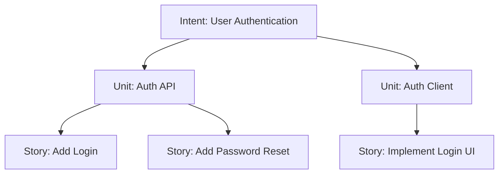
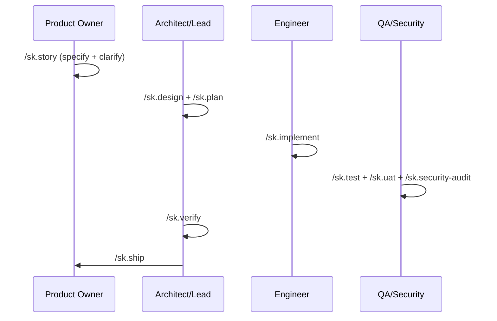

# 🚀 SpecKit-SSD-SDLC

> **The SDLC framework for AI-Native Engineering Teams.**

**SpecKit-SSD-SDLC** (Spec-Driven Development) provides a structured, high-fidelity process for cross-functional teams to collaborate with AI agents. It eliminates "hallucination-by-omission" by enforcing a strict hierarchy of truth from business intent to verified code.

---

## 📖 Table of Contents
- [🎯 The SpecKit Way (Philosophy)](#-the-speckit-way-philosophy)
- [⚡ Quick Start: Team Onramp](#-quick-start-team-onramp)
- [🎭 Role-Based Workflows](#-role-based-workflows)
- [📜 Command Reference](#-command-reference)
- [📦 Artifact Reference](#-artifact-reference)
- [🏗️ FAQ & Technical Details](#-faq--technical-details)

---

## 🎯 The SpecKit Way (Philosophy)

SpecKit is built on a single core principle: **Context is the currency of AI productivity.** 

Most AI failures occur because the model lacks context on *why* a decision was made. SpecKit solves this via:
1. **The Hierarchy of Truth**: Intent (Business Value) → Unit (Technical Domain) → Story (Atomic Task).
2. **Atomic Context Tiers**: 3-tiered Knowledge Bases that prevent LLM context-overflow.
3. **Spec-Aware Gates**: Every implementation step is validated against high-level specs before it can be shipped.

---

## ⚡ Quick Start: Team Onramp

### 1. Initialize for the Team
SpecKit is added as a **git subtree** so you can stay in sync with our upstream framework improvements.

```bash
git subtree add --prefix=.speckit https://github.com/ajorobert/SpecKit-SSD-SDLC main --squash
bash .speckit/setup.sh
/sk.init    # Runs interactive interview to build your .specify/memory files (incl. skill-routing.md)
```

`main` is the release branch (tagged by version, see `VERSION`); `dev` is the integration branch.

**Add your stack knowledge (capability packs).** The framework is process only — it ships no stack or
architecture opinion. Copy the packs you want from `.speckit/skills_archive/` (or write your own) into
`.claude/skills/<pack>/`, then register them in `.specify/memory/skill-routing.md`:

```bash
cp -r .speckit/skills_archive/backend/backend-architecture .claude/skills/
# then add a row to .specify/memory/skill-routing.md  (see .speckit/skills_archive/skill-routing.example.md)
```

### What `setup.sh` touches
| Path | Behaviour |
|---|---|
| `.claude/skills/sk.*`, `governance/`, the 5 memory-pointer skills, framework agents, `.claude/hooks/*.sh` | Synced (framework-owned; `sk.*` is a reserved namespace) |
| `.claude/.speckit-manifest` | Written (version + owned paths) |
| `.claude/settings.json` | Merged — SpecKit hooks added if absent, deny rules unioned, your `allow` list untouched |
| `CLAUDE.md`, `GEMINI.md` | Only the region between the `SPECKIT-SSD-SDLC MANAGED` markers is replaced |
| `.specify/`, `specs/`, `history/` | Missing files created; existing files never overwritten |
| Everything else under `.claude/` (your packs, `commands/`, `settings.local.json`, …) | Never read, written, or listed |

### 2. Enter a Session
Every member of the team adopts a persona to unlock specialized commands:

```bash
/sk.session start --role {po | architect | lead | backend | frontend | backend-qa | frontend-qa | security}
```

### 3. Set Your Focus
Agents work best when they have a laser-focus. Use `/sk.session focus` to lock onto a story.
```bash
/sk.session focus --story story-AUTH-001
```

---

## 🎭 Role-Based Workflows

SpecKit provides specialized "rails" for every team member. Follow the path for your role:

### 🖋️ Product Owner: From Intent to Story
Your goal is to define *what* gets built without getting bogged down in implementation.
1. **Capture Intent**: `/sk.story` — Decompose a business goal into Units and Stories.
2. **Clarify**: The agent will loop until the story meets the "Definition of Ready."
3. **Review Ready**: Use `/sk.session list` to see which stories are `ready` for the Architect.

> **🔍 Review Ritual:** Audit `intent.md` and the `01-story/` artifacts (`story.md`, `acceptance-criteria.md`) under `specs/intents/{intent}/units/{unit}/`. Ensure the **Acceptance Criteria** are measurable and match your original business goal.

### 📐 Architect: From Requirement to Contract
Your goal is to ensure technical consistency across services.
1. **Design**: `/sk.design` — Generate `02-design/` `architecture.md`, `database-design.md`, and `contracts/api-spec.json`.
2. **ADR**: `/sk.adr` — Record significant technical decisions.
3. **Guide**: The routing `guide.yaml` is auto-generated to keep future developers oriented.

> **🔍 Review Ritual:** Audit `02-design/architecture.md` and `02-design/contracts/api-spec.json` under the unit folder. Verify that the **Domain Boundaries** are respected and that the data model doesn't create circular dependencies.

### 💻 Engineer: From Plan to Code
Your goal is high-quality implementation with zero technical debt.
1. **Plan**: `/sk.plan` — Generate one technical implementation plan per impacted project.
2. **Implement**: `/sk.implement` — Follow the plan's checklist to write code and tests.
3. **Review**: `/sk.review` — Perform a spec-aware self-review before submitting.

> **🔍 Review Ritual:** Audit `03-plan/{Project}/plan.md` and `tasks.md`, then track delivery in `04-implementation/{Project}/progress.md`. Check `history/prompts/` for any novel tradeoffs recorded during complex implementations.

### 🛡️ QA & Security: The Quality Gate
Your goal is to certify that the work meets the team's standards.
1. **Verify Contracts**: `/sk.test` — Run provider/consumer contract tests.
2. **UAT**: `/sk.uat` — Perform acceptance testing against the criteria in the story.
3. **Audit**: `/sk.security-audit` — Run OWASP/STRIDE scans before shipping.

> **🔍 Review Ritual:** Audit `02-design/contracts/test-plan.md`, the `05-test/{Project}/` suites, `06-uat/signoff.md`, and `07-security-audit/owasp-report.md`. Verify that **all** Acceptance Criteria have mapped tests and no CRITICAL vulnerabilities are open.

---

### 3. Understand the Hierarchy & Session Focus

SpecKit organizes work into a strict top-down structure:
- **Intent**: A high-level business goal or feature (e.g., *User Authentication*).
- **Unit**: A specific technical bounded context or service (e.g., *Auth API*).
- **Story**: A single developer task or atomic slice of work (e.g., *Add password reset endpoint*).



**How do commands know what to work on?**
You use `/sk.session focus` to lock your agent onto a specific level. SpecKit saves this in a local `.claude/session.yaml` file. Every `/sk.*` command automatically reads this file, so the agent intrinsically knows which story or unit it is modifying without you having to repeatedly specify it.

**How do you move from Intent to Story?**
1. Run `/sk.story` on an **Intent**—the agent will autonomously decompose it into **Units** and **Stories**, and loop through clarification until the output meets completeness requirements.
2. Shift your focus downward using your session to execute the actual technical work:

```bash
/sk.session focus --intent user-auth               # Focus high-level for /sk.impact
/sk.session focus --unit auth-api                  # Shift focus downward for /sk.design_sub_architecture
/sk.session focus --story story-AUTH-API-001       # Shift focus to the exact ticket for /sk.plan and /sk.implement
```

> **💡 Where do these names come from?**
> The `/sk.story` command automatically generates these tracking IDs, names, and their corresponding markdown files under `specs/intents/` when you outline and decompose work. 
> 
> **📊 How do I check story statuses?**
> Run `/sk.session list` to get a live dashboard view of all stories and their current workflow phase (e.g., `draft`, `in-progress`, `review`, `done`).

### 4. Run the SDLC



Commands marked `[optional]` are skippable. Commands marked `[conditional]` are required only in certain cases. Everything else is mandatory.

```
── SPECIFY ──────────────────────────────────────────────────────────────────────
/sk.story                ← capture intent → units → stories; ensures completeness via clarify loop (po)
                           --bug flag: bug report framing (expected/actual/repro) instead of user story
/sk.story --specify      ← [targeted] run Capture phase only: interview matrix → decomposition (po)
/sk.story --clarify      ← [targeted] run Clarify loop: resolves ambiguities via architect/po (architect/lead)
[/sk.impact]             ← [optional] assess blast radius on existing services (architect)

── ARCHITECTURE ─────────────────────────────────────────────────────────────────
/sk.design               ← full design pipeline: architecture → data model → API contracts (architect)
                           [conditional: runs based on unit stories and checkpoint mode]
[/sk.adr]                ← [optional] record a significant architecture decision (architect)

── PLAN ─────────────────────────────────────────────────────────────────────────
/sk.plan                 ← unit-level technical implementation plan and cross-story analysis (lead)
[/sk.knowledge-base]     ← [optional] generate or update knowledge base tiers (architect)

── FAST TRACK ───────────────────────────────────────────────────────────────────
[/sk.ff]                 ← sk.story→architecture→plan in one shot (lead)
                           --bug flag: skips architecture step; runs sk.story --bug instead
[/sk.hotfix]             ← P0 incident fast path: plan→implement→ship (lead)

── IMPLEMENT ────────────────────────────────────────────────────────────────────
/sk.implement            ← define tasks and execute implementation phase-by-phase (backend/frontend)
[/sk.investigate]        ← [optional] spec-aware debugging when blocked (backend/frontend)
[/sk.perf]               ← [optional] performance profiling and optimization cycle (backend/frontend)
[/sk.migrate]            ← [optional] db migration lifecycle via expand/contract (backend)
[/sk.refactor]           ← [optional] scoped technical debt resolution (backend/frontend)
[/sk.phr]                ← [optional] record significant decisions or tradeoffs made (any)

── REVIEW & QUALITY ─────────────────────────────────────────────────────────────
[/sk.review]             ← [recommended] spec-aware code review: boundaries + contracts + ADRs (backend/frontend)
/sk.test                 ← generate & run contract + integration tests (backend-qa/frontend-qa)
[/sk.uat]                ← [conditional: frontend work] user acceptance testing per surface (frontend-qa)
                           --platform {surface} → tooling from skill-routing.md ## Surfaces
                           native surfaces never use browser tooling
/sk.security-audit       ← OWASP Top 10 + STRIDE audit, secrets scan (security)
/sk.verify               ← PASS/FAIL across all quality gates — must pass before ship (architect/lead)
                           Gate 1: Spec (BCR/Stories) | Gate 2: Architecture (Entities/ADRs)
                           Gate 3: Plan (Contracts) | Gate 4: Implementation (Tasks/Standards)
                           Gate 5: Test (Contract/E2E) | Gate 6: Security (OWASP/Secrets)

── SHIP ─────────────────────────────────────────────────────────────────────────
/sk.ship                 ← quality-gated release; /sk.verify must pass (lead)
/sk.rollback             ← automated or manual rollback plan for a shipped story (lead)
```

---

## 📜 Command Reference

### 🛠️ Setup & Session
```text
/sk.init             ← Initialize/update project memory + constitution via interview (any)
/sk.session          ← Manage local session: start/end/focus/status/list/switch/restore (any)
```

### 📋 Specify & Plan
```text
/sk.story            ← Full cycle intent → story capture + validation loop (po)
/sk.story --specify  ← [Targeted] Capture intent → unit → story; --bug for bug report (po)
/sk.story --clarify  ← [Targeted] Resolve ambiguities [modes: --po | --architect] (po/architect/lead)
/sk.impact           ← Assess blast radius of proposed work (architect)
/sk.design           ← Full design pipeline: architecture → data model → API contracts → routing guide (architect)
/sk.plan             ← Unit-level technical implementation plan and validation (lead)
/sk.ff               ← Fast-forward: specify→clarify→architecture→plan; --bug skips architecture (lead)
/sk.hotfix           ← P0 incident fast path: plan→implement→ship (lead)
```

### 💻 Implement & Review
```text
/sk.implement        ← Define tasks and execute implementation phase-by-phase (backend/frontend)
/sk.refactor         ← Scoped technical debt resolution [no new behavior] (backend/frontend)
/sk.perf             ← Performance profiling, diagnosis, and optimization (backend/frontend)
/sk.migrate          ← Database migration lifecycle [expand/contract] (backend)
/sk.review           ← Spec-aware code review: boundaries + contracts + ADRs (backend/frontend)
```

### 🛡️ Quality & Security
```text
/sk.verify           ← PASS/FAIL quality gate across all gates [run after test, before ship] (architect/lead)
/sk.test             ← Generate & run contract + integration tests (QA agents)
/sk.uat              ← Acceptance testing per surface: --platform {surface} (frontend-qa)
/sk.security-audit   ← OWASP Top 10 + STRIDE audit, secrets scan (security)
/sk.investigate      ← Spec-aware debugging (backend/frontend)
```

### 📚 History & Knowledge
```text
/sk.knowledge-base   ← Generate or update knowledge base tier [size-limited per tier] (architect)
/sk.adr              ← Create Architecture Decision Record (architect)
/sk.phr              ← Record Prompt History for significant decisions (any)
```

### 🚀 Operations & Shipping
```text
/sk.ship             ← Quality-gated release: /sk.verify must pass (lead)
/sk.rollback         ← Rollback plan for a shipped story (lead)
```

---

## 📦 Artifact Reference

SpecKit organizes everything it generates into two trees: a **memory layer** (`.specify/memory/`) that holds project-wide, stable context, and a **specs layer** (`specs/intents/`) where every unit of work flows through seven numbered phases. Plan, implementation, and test phases fan out into one sub-folder **per impacted project**.

SpecKit maintains four kinds of memory:

| Memory Type | Purpose | Location |
|---|---|---|
| Project Memory | Persistent project knowledge | `.specify/memory/` |
| Session Memory | Current role and active story | `.claude/session.yaml` |
| Knowledge Base | System, domain, and unit knowledge | `specs/` (generated by `/sk.knowledge-base`) |
| Prompt Cache Tiers | Optimize AI context reuse | Internal prompt injection strategy |
| Story | A specific piece of work being implemented | `specs/` (generated by `/sk.story`)  |

### Memory Layer — `.specify/memory/` (via `/sk.init`)

A workspace router plus isolated per-project memory and shared standards.

> **Note — target layout.** The tree below is the multi-project layout the enhanced `/sk.init` produces. Existing workspaces (and the current branch) may still keep shared `tech-stack.md` and `coding-standards.md` directly under `standards/` rather than per-project under `projects/{Project}/`; skill `inject_files` currently resolve those from `standards/`. Treat the per-project split as the target `/sk.init` will migrate to.

```text
.specify/memory/
├── skill-routing.md              # capability packs, surfaces, migration layouts (project-owned)
├── projects/
│   ├── index.md                  # ROUTER (always loaded): project | type | code-root
│   ├── Backend.API/
│   │   ├── project.md            # identity, ownership, boundaries
│   │   ├── tech-stack.md         # frameworks, versions, libraries
│   │   └── coding-standards.md   # project-specific conventions
│   ├── Customer.Web/             # …same trio per project
│   └── Mobile.App/
└── standards/                    # shared, workspace-wide
    ├── api-standards.md
    ├── data-standards.md
    └── observability-standards.md
```

- **`projects/index.md`** is the always-loaded router. Every command reads it first to map a project name to its `code-root` and memory folder.
- Each project owns an isolated `project.md` / `tech-stack.md` / `coding-standards.md` trio so context stays scoped — a backend task never loads mobile conventions.
- **`standards/*.md`** are inherited by all projects (API, data, observability).
- **`skill-routing.md`** registers the project's capability packs (`## Always`, `## By signal`), its user-facing
  surfaces (framework, platform, E2E tooling) and migration layouts. sk.* skills read it through
  `.claude/skills/governance/pack-resolution.md`; the framework itself names no pack.

### Ownership tiers
| Tier | Owner | Paths |
|---|---|---|
| Framework | SpecKit (synced by `setup.sh`) | `.claude/skills/sk.*`, `.claude/skills/governance`, memory-pointer skills, framework agents, `.claude/hooks/*.sh` |
| Project skills | Your team | every other `.claude/skills/<pack>/`, `.claude/commands/` — seeded from `skills_archive/` |
| Project memory | Your team | `.specify/**`, `specs/**`, `history/**`, `CLAUDE.md` outside the managed block, `.claude/settings.json` |

See [docs/memory-guide.md](docs/memory-guide.md).

### Specs Layer — `specs/intents/` (the 7-phase unit lifecycle)

Created by Product Owners with `/sk.story`, then advanced by each role. `sk.intent` and `sk.unit` resolve automatically when `/sk.story` runs.

```text
specs/intents/001-authentication/
├── intent.md                       # AUTH — business capability
└── units/login/                    # AUTH-LOGIN — feature boundary, flows, impacted projects
    ├── unit-brief.md
    │
    ├── 01-story/                    # /sk.story  (po)
    │   ├── story.md                 # user story
    │   ├── requirement.md           # business requirements
    │   ├── acceptance-criteria.md
    │   └── jira.md                  # optional Jira source
    │
    ├── 02-design/                   # /sk.design (architect)
    │   ├── architecture.md          # system architecture
    │   ├── impact-analysis.md       # impacted projects
    │   ├── api-contract.md          # API communication
    │   ├── database-design.md       # DB changes
    │   └── projects/                # one design note per impacted project
    │       ├── Backend.API.md
    │       ├── Customer.Web.md
    │       ├── Admin.Panel.md
    │       └── Mobile.App.md
    │
    ├── 03-plan/                     # /sk.plan --role … --projects …  (lead → per project)
    │   └── {Project}/
    │       ├── plan.md
    │       ├── tasks.md
    │       ├── checklist.md
    │       ├── jira-subtask.md
    │       └── estimation.md        # backend includes estimation
    │
    ├── 04-implementation/           # /sk.implement --role … --projects …  (per project)
    │   └── {Project}/
    │       ├── implementation.md
    │       ├── progress.md
    │       └── validation.md
    │
    ├── 05-test/                     # /sk.test --role … --projects …  (per project)
    │   └── {Project}/
    │       ├── unit-test.md         # backend
    │       ├── integration-test.md  # backend
    │       ├── component-test.md    # frontend/mobile
    │       └── contract-test.md     # all
    │
    ├── 06-uat/                      # /sk.uat  (frontend-qa)
    │   ├── acceptance-result.md
    │   ├── user-flow-test.md
    │   └── signoff.md
    │
    └── 07-security-audit/           # /sk.security-audit (security)
        ├── owasp-report.md
        ├── stride-review.md
        ├── dependency-scan.md
        └── security-signoff.md
```

**Phase-by-phase artifacts:**

| Phase | Command | Per-project? | Key artifacts |
|---|---|:---:|---|
| `01-story` | `/sk.story` | – | `story.md`, `requirement.md`, `acceptance-criteria.md`, optional `jira.md` |
| `02-design` | `/sk.design` | design notes only | `architecture.md`, `impact-analysis.md`, `api-contract.md`, `database-design.md`, `projects/{Project}.md`, `contracts/api-spec.json` + `test-plan.md` |
| `03-plan` | `/sk.plan` | ✅ | `plan.md`, `tasks.md`, `checklist.md`, `jira-subtask.md`, `estimation.md` (backend) |
| `04-implementation` | `/sk.implement` | ✅ | `implementation.md`, `progress.md`, `validation.md` (+ code under `src/**`) |
| `05-test` | `/sk.test` | ✅ | backend: `unit-test.md`, `integration-test.md`, `contract-test.md` · frontend/mobile: `component-test.md`, `contract-test.md` |
| `06-uat` | `/sk.uat` | – | `acceptance-result.md`, `user-flow-test.md`, `signoff.md` |
| `07-security-audit` | `/sk.security-audit` | – | `owasp-report.md`, `stride-review.md`, `dependency-scan.md`, `security-signoff.md` |

> **`02-design/contracts/`:** `api-spec.json` defines the API boundary; the accompanying `test-plan.md` has one consumer section per impacted Frontend/Mobile project (`### {Project}`) so a contract change surfaces exactly which surface is affected.

### Knowledge & History (`specs/` and `history/`)
Ensures the framework remembers *why* decisions were made, and *where* to look.
- **`knowledge-base.md` (via `/sk.knowledge-base`)** — non-derivable context at the System (≤300 lines), Domain (≤250 lines), or Unit (≤150 lines) tier. Overflow is extracted to the next tier down.
- **`guide.yaml` (via `/sk.design`)** — auto-generated 3-tier routing index (System, Domain, Unit) that points agents at relevant code before they start debugging.
- **`history/adr/ADR-{NNN}.md` (via `/sk.adr`)** — Architecture Decision Records: context, options, justification.
- **`history/prompts/**/PHR-{NNN}-{date}.md` (via `/sk.phr`)** — Prompt History Records of highly effective prompts for reuse.

---

---

## 🏗️ FAQ & Technical Details

<details>
<summary><strong>❓ FAQ: Why all the files?</strong></summary>

SpecKit generates many artifacts (`intent.md`, `architecture.md`, `tasks.md`, etc.) to solve "LLM context drift." By breaking technical debt and business intent into atomic, small files, we ensure that every AI interaction is focused on the minimum required context, significantly increasing the reliability of the output.

</details>

<details>
<summary><strong>❓ FAQ: Do I need gstack?</strong></summary>

No. SpecKit is platform-neutral. However, [gstack](https://github.com/garrytan/gstack) is highly recommended for frontend teams as it enables visual design mocking (`/design-shotgun`) and real browser UAT loops which SpecKit uses natively if detected.

</details>

<details>
<summary><strong>❓ FAQ: How do I upgrade SpecKit?</strong></summary>

Since SpecKit is added as a git subtree, upgrades are simple:
```bash
git subtree pull --prefix=.speckit https://github.com/ajorobert/SpecKit-SSD-SDLC main --squash
bash .speckit/setup.sh
```
Upgrades only replace framework-owned paths. Your capability packs, `.claude/commands/`, the `allow` list in
`.claude/settings.json`, `settings.local.json`, everything in `.specify/`, `specs/`, `history/`, and the parts of
`CLAUDE.md` / `GEMINI.md` outside the managed markers survive untouched. Re-running `setup.sh` with no upstream
change produces no diff.

</details>

<details>
<summary><strong>❓ FAQ: Where did the stack skills go?</strong></summary>

Stack and pattern knowledge (for example backend architecture, data access, web and mobile patterns, DDD design
principles, accessibility standards) now lives in `skills_archive/` as copyable starting points. Projects own
the packs they adopt and register them in `.specify/memory/skill-routing.md`. See
[skills_archive/README.md](skills_archive/README.md).

</details>

---

<details>
<summary><strong>🏗️ Execution Layer & Memory Structure</strong></summary>

- **Foundation**: Unified execution layer in `.claude/` (skills under `.claude/skills/sk.*/`, agents under `.claude/agents/`, session state in `.claude/session.yaml`).
- **Memory Layer (`.specify/memory/`)**:
  - `projects/index.md` — always-loaded router (project | type | code-root)
  - `projects/{Project}/` — isolated per-project `project.md`, `tech-stack.md`, `coding-standards.md` *(target layout; current branch keeps `tech-stack.md`/`coding-standards.md` under `standards/`)*
  - `standards/` — shared `api-standards.md`, `data-standards.md`, `observability-standards.md`
  - `system-context.md`, `domain-model.md`, `service-registry.md`, `architecture-decisions.md` (ADR index)
- **Knowledge Base System (`specs/`)**: Tier 1 (System-level), Tier 2 (Domain-level), Tier 3 (Units) containing only non-derivable context.

</details>

<details>
<summary><strong>📈 Adaptive Checkpoints & Quality Gates</strong></summary>

### Checkpoint Modes
Stories are classified by `sk.story` to govern execution speed. The value lives in `01-story/story.md` frontmatter (`checkpoint_mode`) — the single source every gate and hook reads:
- `autopilot`: No contract changes. `/sk.ff` runs end-to-end.
- `confirm`: New feature. Pause pending approval after `/sk.plan`.
- `validate`: Breaking changes/new service. Pauses after `/sk.design_sub_architecture` **and** `/sk.plan`.

### The 6 Quality Gates (`/sk.verify`)
1. **Spec** - Acceptance criteria written, no missing dependencies.
2. **Architecture** - Stories covered, entities added, cross-service ADRs defined.
3. **Plan** - Contracts defined, checkpoint approvals cleared.
4. **Implementation** - Every `03-plan/{Project}/tasks.md` task done in `progress.md`, no standard violations.
5. **Test** - Contract & E2E tests passing.
6. **Security** - No CRITICAL findings, secrets scan clean.

</details>

<details>
<summary><strong>👥 Agent Personas</strong></summary>

- **`po`** - Defines spec intents, units, stories.
- **`architect`** - Oversees service design, data models, contracts, ADRs.
- **`lead`** - Implementation plans, task breakdowns.
- **`backend`** / **`frontend`** - Implementation executors.
- **`backend-qa`** / **`frontend-qa`** - Testing, contract validation.
- **`security`** - Audit, STRIDE, secrets scanning.

</details>

<details>
<summary><strong>📊 Prompt-Cache Optimization & Telemetry</strong></summary>

SpecKit is tuned for Anthropic's prefix-based prompt cache (5-min TTL, up to 4 `cache_control` breakpoints). Skills layer injected files by volatility so common context stays in the cacheable prefix while story- and iteration-specific content goes in the tail.

### Tier Model
- **Tier A — Framework invariant**: governance + standards + system-context + ADRs + design-phase packs. Changes weekly.
- **Tier B — Domain/unit invariant**: domain-model, service-registry, unit knowledge-base, architecture.md, api-spec.json, capability packs. Stable across a dev's iteration loop.
- **Tier C — Story invariant**: `01-story/story.md` + `03-plan/{Project}/plan.md`. Stable across 3–10 dev iterations on the same story.
- **Tier D — Iteration tail**: diff, test output, review notes, user input, session-derived scalars (`active_story_id`, `active_unit_id`, `role`).

"Dynamic" is relative to the caller's loop: `01-story/story.md` is Tier D for a PO hopping stories but Tier C for a dev grinding one story.

### Canonical inject_files order (all sk.* skills)
`governance rules → standards → system-context → ADRs → domain-model → service-registry → design-phase pack → capability packs (manifest order)` → (cache boundary) → tail wrapper containing story/plan/review-notes/user input.

`session.yaml` is **not** in any skill's `inject_files` (except `sk.session` itself). Skills `Read` it at runtime so its contents land in Tier D naturally.

### Telemetry hook
A `Stop` hook ([.claude/hooks/log-cache-metrics.sh](.claude/hooks/log-cache-metrics.sh)) appends one JSONL row per assistant turn to `.claude/cache-metrics.jsonl`. Captured fields: `timestamp, sessionId, model, skill_name, active_story_id, role, cache_read, cache_creation, input_tokens, output_tokens, gitBranch, cwd`. Zero token cost — pure local file I/O reading the transcript the harness already writes.

### Reading the metrics
```bash
bash .claude/hooks/cache-metrics-report.sh                  # overall + by-skill + by-role hit rate
bash .claude/hooks/cache-metrics-report.sh tail 20          # last 20 turns, raw
bash .claude/hooks/cache-metrics-report.sh since 2026-04-24  # rows since date
```
Hit rate = `cache_read / (cache_read + cache_creation + input_tokens)`. Sustained low hit rate on consecutive same-role calls indicates a prefix-stability regression.
</details>

---

## 🗂️ Project Flow Structure

The complete directory layout a SpecKit workspace produces — the `/sk.init` memory layer and one fully-walked unit through all seven phases. The `memory/` sub-tree shows the target per-project layout (see the note under [Memory Layer](#memory-layer--specifymemory-via-skinit)); the current branch still keeps `tech-stack.md`/`coding-standards.md` under `standards/`:

```text
.specify/
│
├── memory/                              # Created by /sk.init
│   │
│   ├── projects/
│   │   │
│   │   ├── index.md                     # ROUTER (always loaded)
│   │   │                                # project | type | code-root
│   │   │
│   │   ├── Backend.API/
│   │   │   ├── project.md
│   │   │   ├── tech-stack.md
│   │   │   └── coding-standards.md
│   │   │
│   │   ├── Customer.Web/
│   │   │   ├── project.md
│   │   │   ├── tech-stack.md
│   │   │   └── coding-standards.md
│   │   │
│   │   └── Mobile.App/
│   │       ├── project.md
│   │       ├── tech-stack.md
│   │       └── coding-standards.md
│   │
│   └── standards/
│       ├── api-standards.md
│       ├── data-standards.md
│       └── observability-standards.md
│
│
└── specs/
    │
    └── intents/             # Automatically resolve sk.intent and sk.unit by invoking the sk.story_sub_specify subcommands within sk.story.
        │
        └── 001-authentication/
            │
            ├── intent.md                    # AUTH - Authentication
            │                                #
            │                                # Intent:
            │                                # Business capability
            │                                # Example: Authentication
            │
            └── units/
                │
                └── login/
                    │
                    ├── unit-brief.md        # AUTH-LOGIN
                    │                        #
                    │                        # Feature boundary
                    │                        # User flows
                    │                        # Impacted projects
                    │
                    ├── 01-story/                    # /sk.story
                    │   │
                    │   ├── story.md                 # user story
                    │   ├── requirement.md           # business requirements
                    │   ├── acceptance-criteria.md
                    │   └── jira.md                  # optional Jira source
                    │
                    │
                    │
                    ├── 02-design/                   # /sk.design
                    │   │
                    │   ├── architecture.md          # system architecture
                    │   ├── impact-analysis.md       # impacted projects
                    │   ├── api-contract.md          # API communication
                    │   ├── database-design.md       # DB changes
                    │   │
                    │   └── projects/
                    │       │
                    │       ├── Backend.API.md
                    │       ├── Customer.Web.md
                    │       ├── Admin.Panel.md
                    │       └── Mobile.App.md
                    │
                    │
                    ├── 03-plan/                     # /sk.plan
                    │   │
                    │   ├── Backend.API/             # /sk.plan --role backend --projects api
                    │   │   │
                    │   │   ├── plan.md
                    │   │   ├── tasks.md
                    │   │   ├── checklist.md
                    │   │   ├── jira-subtask.md
                    │   │   └── estimation.md
                    │   │
                    │   ├── Customer.Web/            # /sk.plan --role frontend --projects web
                    │   │   │
                    │   │   ├── plan.md
                    │   │   ├── tasks.md
                    │   │   ├── checklist.md
                    │   │   └── jira-subtask.md
                    │   │
                    │   ├── Admin.Panel/             # /sk.plan --role frontend  --projects admin
                    │   │   │
                    │   │   ├── plan.md
                    │   │   ├── tasks.md
                    │   │   ├── checklist.md
                    │   │   └── jira-subtask.md
                    │   │
                    │   └── Mobile.App/              # /sk.plan --role mobile   --projects mobile
                    │       │
                    │       ├── plan.md
                    │       ├── tasks.md
                    │       ├── checklist.md
                    │       └── jira-subtask.md
                    │
                    ├── 04-implementation/           # /sk.implement
                    │   │
                    │   ├── Backend.API/             # /sk.implement --role backend --projects api
                    │   │   │
                    │   │   ├── implementation.md
                    │   │   ├── progress.md
                    │   │   └── validation.md
                    │   │
                    │   ├── Customer.Web/            # /sk.implement --role frontend --projects web
                    │   │   │
                    │   │   ├── implementation.md
                    │   │   ├── progress.md
                    │   │   └── validation.md
                    │   │
                    │   ├── Admin.Panel/             # /sk.implement --role frontend  --projects admin
                    │   │   │
                    │   │   ├── implementation.md
                    │   │   ├── progress.md
                    │   │   └── validation.md
                    │   │
                    │   └── Mobile.App/              # /sk.implement --role mobile   --projects mobile
                    │       │
                    │       ├── implementation.md
                    │       ├── progress.md
                    │       └── validation.md
                    │
                    │
                    ├── 05-test/                        # /sk.test
                    │   │
                    │   ├── Backend.API/                # /sk.test --role backend --projects api
                    │   │   ├── unit-test.md
                    │   │   ├── integration-test.md
                    │   │   └── contract-test.md
                    │   │
                    │   ├── Customer.Web/               # /sk.test --role frontend --projects web
                    │   │   ├── component-test.md
                    │   │   └── contract-test.md
                    │   │
                    │   ├── Admin.Panel/                # /sk.test --role frontend  --projects admin
                    │   │   ├── component-test.md
                    │   │   └── contract-test.md
                    │   │
                    │   └── Mobile.App/                 # /sk.test --role mobile   --projects mobile
                    │       ├── component-test.md
                    │       └── contract-test.md
                    │
                    │
                    ├── 06-uat/              # /sk.uat
                    │   │
                    │   ├── acceptance-result.md
                    │   ├── user-flow-test.md
                    │   └── signoff.md
                    │
                    │
                    └── 07-security-audit/   # /sk.security-audit
                        │
                        ├── owasp-report.md
                        ├── stride-review.md
                        ├── dependency-scan.md
                        └── security-signoff.md
```
